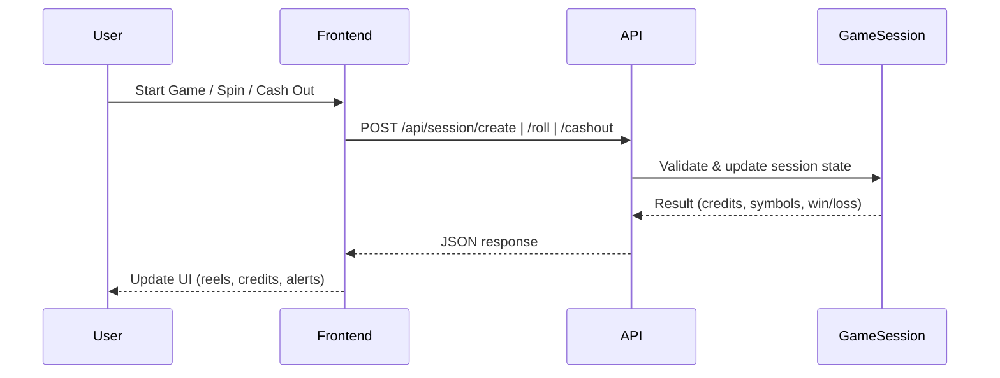

# 🎰 Online Slot Machine Challenge (Next.js Edition)

[](https://globo-hire-2t5f.vercel.app/)

**Try the production app here:**
👉 [https://globo-hire-2t5f.vercel.app/](https://globo-hire-2t5f.vercel.app/)

A full-stack implementation of an online slot machine game with a twist: **the house always wins!**  
This project demonstrates professional frontend and backend development using **Next.js 13+ (App Router, TypeScript, React, Tailwind CSS)**, with a focus on clean architecture, robust business logic, and a polished casino-like user experience.

---

## 🎮 Game Overview

- **Start a session:** Players receive 10 credits.
- **Each roll costs 1 credit.**
- **Win by matching all 3 symbols.**
- **Symbols and Payouts:**
  - 🍒 Cherry: 10 credits
  - 🍋 Lemon: 20 credits
  - 🍊 Orange: 30 credits
  - 🍉 Watermelon: 40 credits

### The Twist: House "Cheat" System

- **40–60 credits:** 30% chance to re-roll winning combinations.
- **Over 60 credits:** 60% chance to re-roll winning combinations.
- **Under 40 credits:** Fair play (random results).

---

## 🚀 Getting Started

1. **Install dependencies:**
   ```bash
   npm install
   # or
   yarn install
   # or
   pnpm install
   ```

2. **Run the development server:**
   ```bash
   npm run dev
   # or
   yarn dev
   # or
   pnpm dev
   ```

3. **Open your browser:**  
   Visit [http://localhost:3000](http://localhost:3000) to play the slot machine.

---

## 🏗️ Architecture

The application follows a clean, domain-driven architecture with clear separation of concerns:

```
src/
  app/
    api/
      session/
        create/         # POST /api/session/create (start new game session)
          route.ts
        status/         # GET /api/session/status (get session state)
          route.ts
        cashout/        # POST /api/session/cashout (cash out remaining credits)
          route.ts
      game/
        roll/           # POST /api/game/roll (perform slot machine roll)
          route.ts
    ...                 # Next.js App Router (pages, layouts, etc.)

  components/
    SlotMachine/
      index.tsx             # Main game container
      Reel.tsx              # Individual slot reel
      Credits.tsx           # Credit display
      Controls.tsx          # Game control buttons
      StartButton.tsx       # Neon start overlay
      AnimatedLightBox.tsx  # Casino-style animated border
      GameAlert.tsx         # Game status overlays

  context/
    GameContext.tsx         # Global game state management

  lib/
    GameSession/
      domain/
        GameSession.ts      # Core session logic
        Roll.ts             # Roll result logic
        Symbol.ts           # Symbol definitions
      application/
        RollSlots.ts        # Application service for rolling slots
      infrastructure/
        controllers/
          GameController.ts
          SessionController.ts
        middlewares/
          WithSession.ts
        services/
          RandomNumberGenerator.ts
        repositories/
          InMemoryGameSessionRepository.ts
      ports/
        input/
          IRollSlots.ts
        output/
          IRandomGenerator.ts
          IGameSessionRepository.ts
      singletons.ts         # Singleton instances for controllers/repos

  utils/
    api.ts                  # Typed API client functions

  public/                   # Static assets (images, icons, etc.)
```

- **API Layer:** All backend endpoints are implemented as Next.js API routes under `src/app/api`, following RESTful conventions and using the App Router's `route.ts` structure.
- **Domain Logic (`lib/GameSession/`):** Implements domain-driven design with clear separation between domain models, application services, infrastructure (controllers, repositories, services, middlewares), and ports (interfaces).
- **Frontend:** All UI components are modularized under `components/SlotMachine`, with global state managed by a React Context in `context/GameContext.tsx`.
- **Utilities:** Typed API client functions for frontend-backend communication.
- **Public:** Static assets for the casino look and feel.

This structure ensures maintainability, scalability, and a clear separation of concerns between API, domain logic, and UI.

---

## 🧠 Technical Implementation Highlights

- **State Management:** React Context API for global game state.
- **Server-side Logic:** Next.js API routes with singleton pattern for in-memory session state.
- **Advanced Animations:** React hooks and CSS for realistic slot machine behavior.
- **Responsive Design:** Tailwind CSS for a fully responsive, mobile-friendly layout.
- **TypeScript:** Strong typing throughout for maintainability and safety.
- **Casino Feel:** Animated lights, spinning reels, neon buttons, and visual feedback.
- **Cheating Mechanism:** Server-side logic increases the house edge as player credits grow.
- **Session Management:** Secure, cookie-based session tracking.
- **Animated Transitions:** Smooth reel spinning with sequenced reveals.
- **Evasive Cash Out Button:** Playful, interactive button that avoids the cursor.
- **Accessibility:** Keyboard navigation and semantic HTML.

---

## 🎲 Game Rules & Cheating Mechanics

- **Starting Credits:** Each new session starts with 10 credits.
- **Roll Cost:** 1 credit per roll.
- **Winning Condition:** All three symbols match.
- **House Edge:**
  - Under 40 credits: Fair play (random results).
  - 40–60 credits: 30% chance winning rolls are re-rolled.
  - Over 60 credits: 60% chance winning rolls are re-rolled.
- **Game Over:** Session ends when credits reach 0 or player cashes out.

---

## 🪄 Unique Features

- **React-based slot machine:** Realistic slot machine animations and behavior.
- **Animated Light Border:** Casino-style animated lights that react to game state.
- **Evasive Cash Out Button:** Playful, interactive button that avoids the cursor.
- **Realistic Reel Animations:** Symbols reveal with delays (1s, 2s, 3s) for genuine slot machine feel.
- **Visual Feedback:** Winning combinations trigger celebration animations and sounds.
- **All code and comments in professional English.**

---

## 📝 Backend API Flow



---

## 👨‍💻 Professional Development Practices

- **Clean Architecture:** Domain-driven design and separation of concerns.
- **Comprehensive Error Handling:** User-friendly error messages and fallbacks.
- **Internationalization Ready:** All code and comments in clear, professional English.
- **Responsive Design:** Works on all screen sizes from mobile to desktop.
- **Accessibility:** Keyboard navigation and semantic HTML.
- **Defensive Programming:** Input validation and robust error handling.
- **Manual Test Cases:** Session creation, roll mechanism, win detection, cheating logic, cash out, and session end.

---

## 🚀 Deployment

The application can be deployed on Vercel or any platform supporting Next.js 13+.

---

## 🙌 Credits & Attribution

This project was developed as a response to a coding challenge.  
The implementation demonstrates full-stack development skills using modern web technologies.

- **Emoji symbols:** Standard Unicode emojis
- **Animation techniques:** Custom-built React animations
- **Game logic:** Original implementation following challenge specifications

---

## 📄 License

MIT

---

**Enjoy your luck at the slots! 🎰 (Just remember, the house always wins!)**
